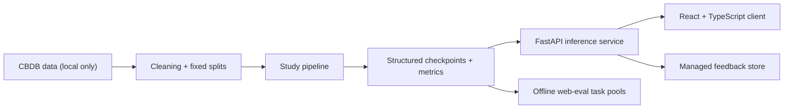

# Chinese Name Generator

A comparative machine learning project on **Chinese micro-sequence generation** across three modeling strategies:

- `markov`: a first-order probabilistic baseline
- `lstm`: a character-level recurrent model
- `transformer`: a small causal decoder-only Transformer

The repository now exposes two connected public surfaces:

- a **Playground** for open-ended exploration and side-by-side model comparison
- an **Evaluation Lab** for lightweight but analyzable human feedback tasks

The Playground also includes a **Name Workshop** for users who already have a favorite character or phrase. It separates historical-pattern search from creative ancient-style completion so the product does not blur corpus evidence with imagination.

## Why this project exists

This project asks a narrow but useful question:

> What happens when the sequence is extremely short, structurally constrained, and culturally patterned?

Chinese names are a good edge case. They are short, but not trivial. They depend on surname structure, character compatibility, and corpus bias. That makes them useful for testing whether architectural inductive bias still matters when the context window is tiny.

## System architecture



## Repository layout

- `app.py`: FastAPI inference service for Playground and Evaluation Lab
- `frontend/`: React + TypeScript client
- `study.py`: fairness-first study pipeline plus web-eval task-pool export
- `plot_study.py`: figure generation for the deeper study
- `study_protocol.md`: detailed study design and execution order
- `technical_blog.md`: current write-up of the modeling story
- `data/sample_names.json`: local fallback sample names for API smoke tests
- `data/sample_eval_tasks.json`: local fallback task pool for the Evaluation Lab

## Quick start

### 1. Python environment

```bash
python -m venv .venv
.venv\Scripts\activate
pip install -r requirements.txt
```

### 2. Run the API

```bash
copy .env.example .env
uvicorn app:app
```

On Windows, if you want hot reload during development, start PowerShell with:

```powershell
$env:KMP_DUPLICATE_LIB_OK="TRUE"
uvicorn app:app --reload --port 8001
```

`--reload` can trigger a duplicate OpenMP runtime error on some Windows setups when `torch` is imported.

### 3. Run the frontend

```bash
cd frontend
copy .env.example .env
npm install
npm run dev
```

The frontend expects the API at `http://127.0.0.1:8001` by default.

## Public API v1

Core inference endpoints:

- `GET /health`
- `GET /models`
- `POST /generate`
- `POST /generate/historical-pattern`
- `POST /generate/infill`
- `GET /dynasties`
- `POST /generate/dynasty`
- `POST /compare`

Evaluation and feedback endpoints:

- `GET /eval/tasks?task_type=blind_pairwise|dynasty_guess`
- `POST /feedback`

Example classic generation request:

```bash
curl -X POST http://127.0.0.1:8001/generate ^
  -H "Content-Type: application/json" ^
  -d "{\"model_type\":\"lstm\",\"count\":5,\"seed\":\"李\",\"temperature\":0.8}"
```

Example dynasty generation request:

```bash
curl -X POST http://127.0.0.1:8001/generate/dynasty ^
  -H "Content-Type: application/json" ^
  -d "{\"dynasty_id\":6,\"count\":5,\"seed\":\"李\"}"
```

## Public demo surfaces

### Playground

- `Classic`: direct live generation from Markov, LSTM, or Transformer
- `Dynasty`: Markov-only dynasty mode based on curated CBDB dynasty slices
- `Compare`: side-by-side generation with lightweight `favorite_pick` feedback
- `Name Workshop`: fixed-token naming with two intent-aware modes

`Name Workshop` has two routes:

- `Historical Pattern`: uses the cleaned CBDB-derived corpus plus constrained search. It returns corpus support count, support level, sampling attempts, and cautious evidence wording.
- `Creative Ancient-Style`: uses a template Fill-in-the-Middle decoder checkpoint for controllable creative completion. If FIM artifacts are not configured, the API returns a controlled `503` and the UI explains that creative mode is unavailable.

### Evaluation Lab

- `Blind Pairwise`: anonymous A/B comparison from offline pre-generated task pools
- `Dynasty Guess`: style-recognition task from dynasty-conditioned Markov batches

The client is bilingual and supports English/Chinese switching in the browser.

## Feedback storage

The backend expects a managed Postgres-compatible database URL for public feedback collection:

```powershell
$env:CNG_FEEDBACK_DATABASE_URL="postgresql://..."
$env:CNG_FEEDBACK_AUTO_INIT="true"
uvicorn app:app
```

If feedback storage is not configured, the feedback endpoint will report itself unavailable while the rest of the app still works.

## Fairness-first study pipeline

The deeper study workflow is centered on `study.py` and `plot_study.py`.

### 1. Create the fixed split

```bash
python study.py prepare-split --db-path latest.db --split-path data/cbdb_fixed_split_v1.json
```

### 2. Run the default study sweep

```bash
python study.py run-default-study --db-path latest.db --split-path data/cbdb_fixed_split_v1.json
```

### 3. Aggregate metrics and figures

```bash
python study.py summarize --split-path data/cbdb_fixed_split_v1.json
python plot_study.py --run-id fairness_v1
```

### 4. Export blinded human-evaluation sheets

```bash
python study.py export-human-eval --split-path data/cbdb_fixed_split_v1.json --temperature 0.8
```

### 5. Export web-evaluation task pools

```bash
python study.py export-web-eval --split-path data/cbdb_fixed_split_v1.json --temperature 0.8 --output-path data/generated_eval_tasks.json
```

This command materializes:

- `blind_pairwise` tasks from saved best checkpoints
- `dynasty_guess` tasks from dynasty-specific Markov generations

The full protocol is documented in `study_protocol.md`.

### 6. Train the FIM template decoder

The FIM route trains a conditional decoder-only Transformer. The prompt encodes the fixed token, requested position, and optional seed; loss is applied only to the full-name target after `<SEP>`.

```bash
python study.py train-fim-template --db-path latest.db --split-path data/cbdb_fixed_split_v1.json --seed 13 --batch-size 128 --max-epochs 20
python study.py evaluate-fim-template --db-path latest.db --split-path data/cbdb_fixed_split_v1.json --seed 13 --fixed-tokens 飞,妃,若虚 --attempts-per-sample 20
```

Deployment configuration for a trained FIM checkpoint:

```powershell
$env:CNG_ENABLE_FIM_MODE="true"
$env:CNG_FIM_WEIGHTS="artifacts/fim_template/best.ckpt"
$env:CNG_FIM_VOCAB="artifacts/fim_template/vocab.pkl"
$env:CNG_FIM_CONFIG="artifacts/fim_template/config.json"
```

Set these variables only after evaluation shows an acceptable constraint satisfaction rate. Otherwise `/generate/infill` should remain disabled.

## Data and artifact policy

- `latest.db` is a **local-only** artifact and is ignored by `.gitignore`.
- `data/sample_names.json` and `data/sample_eval_tasks.json` exist so the API and frontend can still smoke-test without the private CBDB dump.
- The study pipeline writes structured artifacts under `results/<run_id>/...`.
- Public web-eval tasks should be generated from saved study artifacts, not from live frontend requests.
- FIM template artifacts are versioned separately from the main Markov/LSTM/Transformer checkpoints.

## Deployment notes

This repo is set up for a low-cost Render deployment:

- frontend: Vite static app in `frontend/`
- backend: FastAPI app served by `uvicorn`
- deployment template: `render.yaml`
- feedback storage: Supabase or another managed Postgres database

### Release artifacts

Large model files are not committed to the public repository. Prepare the files for a GitHub Release with:

```bash
python scripts/build_markov_artifact.py --db-path latest.db --output-path markov_model.pkl
python scripts/prepare_release_artifacts.py
```

Upload everything in `release_artifacts/` to a GitHub Release, then set `CNG_ARTIFACT_BASE_URL` in Render to the release download URL:

```text
https://github.com/Jujun111/neural-mingzi-generator/releases/download/v1.0.0
```

Render downloads missing artifacts during the backend build:

```bash
python scripts/download_artifacts.py
```

### Render environment

The public backend should use these Render environment variables:

- `CNG_ARTIFACT_BASE_URL`: GitHub Release download URL
- `CNG_DEVICE`: `cpu`
- `CNG_ENABLE_FIM_MODE`: `true`
- `CNG_ENABLE_DYNASTY_MODE`: `false`
- `CNG_FEEDBACK_DATABASE_URL`: Supabase Postgres connection string
- `CNG_FEEDBACK_AUTO_INIT`: `true`
- `CNG_CORS_ORIGINS`: deployed frontend URL

The public frontend should use:

- `VITE_API_BASE_URL`: deployed API URL
- `VITE_GITHUB_URL`: public GitHub repo URL
- `VITE_BLOG_URL`: public technical blog URL

### Supabase feedback

Create a Supabase project and use its Postgres connection string as `CNG_FEEDBACK_DATABASE_URL`. If direct connection fails from Render because of network constraints, use the Supabase session pooler connection string instead. With `CNG_FEEDBACK_AUTO_INIT=true`, the backend creates the `feedback_events` table on startup.

### Public v1 behavior

- Dynasty mode is disabled in public v1 because `latest.db` is local-only.
- Classic, Compare, Name Workshop, and Evaluation Lab remain enabled.
- Feedback writes go through the FastAPI backend; the browser never receives database credentials.

## Portfolio angle

This project is designed to communicate four things clearly:

1. I can reason about sequence models and evaluate them critically.
2. I can turn model artifacts into a stable inference API.
3. I can design a more rigorous experiment loop instead of relying on one-off scripts and hand-curated figures.
4. I can connect a public-facing demo to a lightweight real-user feedback pipeline.
