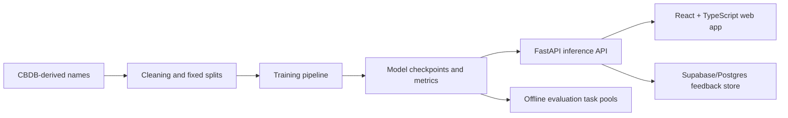

# Neural Mingzi Generator

[English](README.md) | [中文](README.zh-CN.md)

**Neural Mingzi Generator is a bilingual ML systems project for Chinese-style name generation, combining a comparative modeling study, a deployed FastAPI + React demo, and lightweight public feedback collection.**

Live links:

- Web app: https://chinese-name-generator-frontend.onrender.com
- API health: https://chinese-name-generator-api.onrender.com/health
- Technical report: [technical_blog.pdf](technical_blog.pdf)
- Product design note: [product_blog.pdf](product_blog.pdf)

Stack: `PyTorch` · `FastAPI` · `React` · `TypeScript` · `Render` · `Supabase/Postgres`

The public demo currently runs on a free Render instance. To keep the service stable within the free memory limit, the hosted version enables Markov generation and feedback collection by default. Neural checkpoints are included as release artifacts and can be run locally or on a larger backend instance.

## Highlights

- **Three models, one tiny task.** Markov chain, LSTM, and causal Transformer — all trying to generate convincing 2–4 character Chinese names. When the sequence is this short, bigger isn't always better.
- **The optimization plot twist.** The Transformer initially looked much worse than the LSTM. Turns out it wasn't the architecture's fault — a proper warmup and cosine decay schedule closed most of the gap.
- **Name Workshop: history vs. creativity.** `Historical Pattern` mode searches the CBDB corpus for real attestations of a character. `Ancient-Style` mode uses fill-in-the-middle generation to create names that feel classical but aren't in the database. The two modes are deliberately separated so users know what's backed by data and what's a creative suggestion.
- **Real user feedback, no privacy headache.** The Evaluation Lab runs blind A/B tasks and dynasty guessing games. Feedback goes through the backend to Supabase — the browser never sees a database credential.
- **Reproducible by design.** Fixed splits, seeded runs, structured metrics, release artifacts, and deployment-ready API contracts. Everything that matters is versioned and scripted.

## Project Surfaces

This repository has two complementary stories.

**Modeling study:** compares Markov, LSTM, and Transformer generators under a controlled micro-sequence setup. The main technical report focuses on the LSTM-vs-Transformer optimization question and keeps the research claim intentionally narrow.

**Product and systems demo:** turns the generators into an interactive app. Markov supports lightweight generation and dynasty-style exploration; Historical Pattern mode uses constrained search to report corpus support for a requested character; Creative Ancient-Style mode uses FIM-style controllable generation when historical support is weak.


## What You Can Try

The web app has two main surfaces.

**Playground**

- `Classic`: generate names from the available model.
- `Compare`: view side-by-side model outputs when multiple models are enabled.
- `Name Workshop`: provide a fixed character or phrase, then ask the system to search for names that contain it.
- `Dynasty`: an experimental Markov mode based on dynasty slices of CBDB. This requires the private CBDB database and is disabled in the public deployment.

**Evaluation Lab**

- `Blind Pairwise`: choose which anonymous batch feels more like plausible Chinese names.
- `Dynasty Guess`: guess which dynasty style a Markov-generated batch resembles.

Feedback is stored through the backend with anonymous browser session IDs. The browser never receives database credentials.

## Why This Project Is Interesting

The honest motivation: Like many people, sometimes I just wanted to pick a Chinese name but had absolutely no idea where to start. That got me curious, so how did people in Chinese history handle this? The CBDB (China Biographical Database Project) happens to have a massive, carefully curated collection of historical names, so I figured: why not let a few models learn from centuries of real naming practice and see what comes out?

Chinese names are only 2–4 characters long. That's tiny, yet it accompany a person throughout their entire life. A good name needs to get the surname right, keep characters compatible, avoid accidentally copying a real historical figure, and still feel natural. It's a deceptively hard generation task.

This makes it a great stress test for a common assumption in NLP: that bigger, more expressive architectures always win. When your entire sequence fits in a tweet, does a Transformer really beat a simple LSTM? The answer, it turns out, depends more on how you train it than what you train.

The main finding: With respect to the decrease of perplexity, the LSTM demonstrate a marginal advantage over the Transformer. The initial Transformer gap disappeared after fixing the training recipe, and the LSTM still held a slight edge. I'm not claiming LSTMs are superior for all short-sequence tasks, let alone that this tells you something universal about Chinese names. It's one controlled experiment with a specific dataset and a specific model size. And I think that framing makes it more interesting, not less.

## System Overview



## Repository Map

- `app.py`: FastAPI backend for generation, evaluation tasks, and feedback submission
- `frontend/`: React + TypeScript web client
- `study.py`: training, evaluation, ablation, FIM, and task-pool export commands
- `plot_study.py`: study figure generation
- `technical_blog.pdf`: long-form technical report with embedded figures
- `product_blog.pdf`: product and ML-systems design note for Markov, Historical Pattern, and FIM modes
- `study_protocol.md`: experiment design notes
- `data/sample_names.json`: tiny sample data for smoke tests
- `data/sample_eval_tasks.json`: small sample task pool for the Evaluation Lab
- `tests/`: backend and study-pipeline tests

## Run Locally

### 1. Install Python Dependencies

```bash
python -m venv .venv
```

Windows:

```powershell
.venv\Scripts\activate
pip install -r requirements.txt
```

macOS/Linux:

```bash
source .venv/bin/activate
pip install -r requirements.txt
```

### 2. Download Model Artifacts

Large model files are stored as GitHub Release assets rather than committed to the repository.

```bash
export CNG_ARTIFACT_BASE_URL=https://github.com/Jujun111/neural-mingzi-generator/releases/download/v1.0.0
python scripts/download_artifacts.py
```

PowerShell:

```powershell
$env:CNG_ARTIFACT_BASE_URL="https://github.com/Jujun111/neural-mingzi-generator/releases/download/v1.0.0"
python scripts/download_artifacts.py
```

### 3. Start the API

```bash
cp .env.example .env
uvicorn app:app --port 8001
```

PowerShell:

```powershell
copy .env.example .env
uvicorn app:app --port 8001
```

API health check:

```text
http://127.0.0.1:8001/health
```

### 4. Start the Frontend

```bash
cd frontend
cp .env.example .env
npm install
npm run dev
```

PowerShell:

```powershell
cd frontend
copy .env.example .env
npm install
npm run dev
```

The frontend uses `frontend/.env.example` as a template and expects the API at `http://127.0.0.1:8001` during local development.

## API Snapshot

Core endpoints:

- `GET /health`
- `GET /models`
- `POST /generate`
- `POST /generate/historical-pattern`
- `POST /generate/infill`
- `POST /compare`

Evaluation and feedback:

- `GET /eval/tasks?task_type=blind_pairwise`
- `GET /eval/tasks?task_type=dynasty_guess`
- `POST /feedback`

Example request:

```bash
curl -X POST http://127.0.0.1:8001/generate \
  -H "Content-Type: application/json" \
  -d '{"model_type":"markov","count":5,"seed":"\u674e"}'
```

## Study Pipeline

The research workflow is built around fixed train/validation/test splits, repeated random seeds, structured metrics, and artifact-backed plots.

Common commands:

```bash
python study.py prepare-split --db-path latest.db --split-path data/cbdb_fixed_split_v1.json
python study.py run-default-study --db-path latest.db --split-path data/cbdb_fixed_split_v1.json
python study.py summarize --split-path data/cbdb_fixed_split_v1.json
python plot_study.py --run-id fairness_v1
```

The full experiment design is documented in [study_protocol.md](study_protocol.md). The public repository includes sample data for smoke tests, but the full CBDB database is not redistributed here.

## Promotion Notes

Suggested repo description:

```text
Bilingual ML systems demo for Chinese name generation with Markov, LSTM, Transformer, FastAPI, React, and feedback collection.
```

Suggested GitHub topics:

```text
machine-learning deep-learning nlp pytorch fastapi react typescript sequence-modeling transformer lstm markov-chain chinese-nlp name-generator mlops portfolio-project
```

Suggested short launch post:

```text
I built Neural Mingzi Generator, a bilingual ML systems demo for Chinese name generation. It compares Markov, LSTM, and Transformer models, includes a deployed FastAPI + React app, and explores how to separate historical pattern search from creative infill generation.

Live demo: https://chinese-name-generator-frontend.onrender.com
Repo: https://github.com/Jujun111/neural-mingzi-generator
```

## Data and Artifact Policy

- Raw CBDB database files are not committed to this repository.
- Small sample files are included only for local smoke tests.
- Model weights are distributed as release artifacts.
- Study outputs are designed to be reproducible from saved configs, checkpoints, and metrics.
- Public feedback is treated as exploratory evidence, not as a formal human-subjects study.

## Deployment Notes

The public deployment uses:

- Render Static Site for the frontend
- Render Web Service for the FastAPI backend
- GitHub Release assets for model files
- Supabase/Postgres for anonymous feedback events

On Render Free, only lightweight generation is enabled to avoid memory restarts. A larger backend instance can enable the full neural demo by allowing the LSTM, Transformer, and FIM artifacts to load during inference.

## Limitations

- The current results come from a specific cleaned historical-name dataset and a limited model-size regime.
- Human feedback in the public app is lightweight and exploratory.
- Historical-name plausibility does not imply modern naming quality.
- Dynasty mode depends on local CBDB data and is not active in the public demo.
- The free hosted backend is intentionally resource-limited; local or larger-instance runs are better for neural inference.

## License

This project is released under the MIT License. See [LICENSE](LICENSE).
