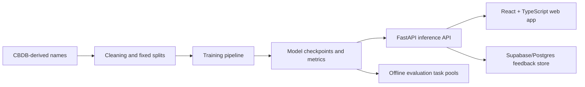

# Neural Mingzi Generator

Neural Mingzi Generator is a small machine-learning system for generating Chinese-style names. It compares three approaches to a deliberately tiny sequence-generation task:

- `Markov`: a lightweight probabilistic baseline
- `LSTM`: a character-level recurrent neural network
- `Transformer`: a small causal decoder-only Transformer

The project includes a bilingual web demo, a FastAPI inference service, a React + TypeScript frontend, and a reproducible study pipeline for model comparison.

## Live Demo

- Web app: https://chinese-name-generator-frontend.onrender.com
- API health: https://chinese-name-generator-api.onrender.com/health
- Technical report: [technical_blog.pdf](technical_blog.pdf)

The public demo currently runs on a free Render instance. To keep the service stable within the free memory limit, the hosted version enables Markov generation and feedback collection by default. Neural checkpoints are included as project artifacts and can be run locally or on a larger backend instance.

## What You Can Try

The web app has two main surfaces.

**Playground**

- `Classic`: generate names from the available model.
- `Compare`: view side-by-side model outputs when multiple models are enabled.
- `Name Workshop`: provide a fixed character or phrase, then ask the system to search for names that contain it.
- `Dynasty`: an experimental Markov mode based on dynasty slices of CBDB. This requires the private CBDB database and is disabled in the public deployment.

**Evaluation Lab**

- `Blind Pairwise`: choose which anonymous batch feels more like plausible Chinese names.
- `Dynasty Guess`: guess which dynasty style a Markov-generated batch resembles.

Feedback is stored through the backend with anonymous browser session IDs. The browser never receives database credentials.

## Why This Project Is Interesting

Chinese names are very short sequences, but they are not simple strings. A generated name has to balance surname structure, character-level compatibility, memorization risk, novelty, and cultural plausibility.

That makes the task a useful stress test for a common assumption in modern sequence modeling: bigger contextual architectures are not always automatically better when the sequence is extremely short and constrained. The current study asks whether recurrent inductive bias can remain competitive in this micro-sequence setting.

The main result is intentionally framed cautiously: the original Transformer gap was mostly explained by optimization, while the LSTM remained slightly ahead after a light tuning-symmetry check. This should be read as evidence from one controlled experimental setup, not as a universal claim about Chinese name generation or Transformer architectures.

## System Overview



## Repository Map

- `app.py`: FastAPI backend for generation, evaluation tasks, and feedback submission
- `frontend/`: React + TypeScript web client
- `study.py`: training, evaluation, ablation, FIM, and task-pool export commands
- `plot_study.py`: study figure generation
- `technical_blog.pdf`: long-form technical report with embedded figures
- `study_protocol.md`: experiment design notes
- `data/sample_names.json`: tiny sample data for smoke tests
- `data/sample_eval_tasks.json`: small sample task pool for the Evaluation Lab
- `tests/`: backend and study-pipeline tests

## Run Locally

### 1. Install Python Dependencies

```bash
python -m venv .venv
```

Windows:

```powershell
.venv\Scripts\activate
pip install -r requirements.txt
```

macOS/Linux:

```bash
source .venv/bin/activate
pip install -r requirements.txt
```

### 2. Download Model Artifacts

Large model files are stored as GitHub Release assets rather than committed to the repository.

```bash
export CNG_ARTIFACT_BASE_URL=https://github.com/Jujun111/neural-mingzi-generator/releases/download/v1.0.0
python scripts/download_artifacts.py
```

PowerShell:

```powershell
$env:CNG_ARTIFACT_BASE_URL="https://github.com/Jujun111/neural-mingzi-generator/releases/download/v1.0.0"
python scripts/download_artifacts.py
```

### 3. Start the API

```bash
cp .env.example .env
uvicorn app:app --port 8001
```

PowerShell:

```powershell
copy .env.example .env
uvicorn app:app --port 8001
```

API health check:

```text
http://127.0.0.1:8001/health
```

### 4. Start the Frontend

```bash
cd frontend
cp .env.example .env
npm install
npm run dev
```

PowerShell:

```powershell
cd frontend
copy .env.example .env
npm install
npm run dev
```

The frontend uses `frontend/.env.example` as a template and expects the API at `http://127.0.0.1:8001` during local development.

## API Snapshot

Core endpoints:

- `GET /health`
- `GET /models`
- `POST /generate`
- `POST /generate/historical-pattern`
- `POST /generate/infill`
- `POST /compare`

Evaluation and feedback:

- `GET /eval/tasks?task_type=blind_pairwise`
- `GET /eval/tasks?task_type=dynasty_guess`
- `POST /feedback`

Example request:

```bash
curl -X POST http://127.0.0.1:8001/generate \
  -H "Content-Type: application/json" \
  -d '{"model_type":"markov","count":5,"seed":"\u674e"}'
```

## Study Pipeline

The research workflow is built around fixed train/validation/test splits, repeated random seeds, structured metrics, and artifact-backed plots.

Common commands:

```bash
python study.py prepare-split --db-path latest.db --split-path data/cbdb_fixed_split_v1.json
python study.py run-default-study --db-path latest.db --split-path data/cbdb_fixed_split_v1.json
python study.py summarize --split-path data/cbdb_fixed_split_v1.json
python plot_study.py --run-id fairness_v1
```

The full experiment design is documented in [study_protocol.md](study_protocol.md). The public repository includes sample data for smoke tests, but the full CBDB database is not redistributed here.

## Data and Artifact Policy

- Raw CBDB database files are not committed to this repository.
- Small sample files are included only for local smoke tests.
- Model weights are distributed as release artifacts.
- Study outputs are designed to be reproducible from saved configs, checkpoints, and metrics.
- Public feedback is treated as exploratory evidence, not as a formal human-subjects study.

## Deployment Notes

The public deployment uses:

- Render Static Site for the frontend
- Render Web Service for the FastAPI backend
- GitHub Release assets for model files
- Supabase/Postgres for anonymous feedback events

On Render Free, only lightweight generation is enabled to avoid memory restarts. A larger backend instance can enable the full neural demo by allowing the LSTM, Transformer, and FIM artifacts to load during inference.

## Limitations

- The current results come from a specific cleaned historical-name dataset and a limited model-size regime.
- Human feedback in the public app is lightweight and exploratory.
- Historical-name plausibility does not imply modern naming quality.
- Dynasty mode depends on local CBDB data and is not active in the public demo.
- The free hosted backend is intentionally resource-limited; local or larger-instance runs are better for neural inference.

## License

This project is released under the MIT License. See [LICENSE](LICENSE).
