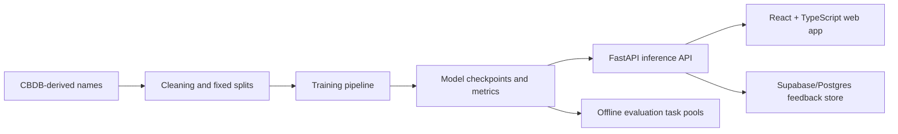

# Neural Mingzi Generator

[English](README.md) | [中文](README.zh-CN.md)

**Neural Mingzi Generator 是一个中文名字生成方向的 ML systems 项目：它结合了 Markov / LSTM / Transformer 三种生成路线、已部署的 FastAPI + React 双语 Web App，以及轻量级真实用户反馈收集。**

公开链接：

- Web app: https://chinese-name-generator-frontend.onrender.com
- API health: https://chinese-name-generator-api.onrender.com/health
- 技术报告: [technical_blog.pdf](technical_blog.pdf)
- 产品设计说明: [product_blog.pdf](product_blog.pdf)

技术栈：`PyTorch` · `FastAPI` · `React` · `TypeScript` · `Render` · `Supabase/Postgres`

当前公网 demo 部署在 Render Free。为了避免免费实例内存不足导致后端重启，公网版本默认启用轻量 Markov 生成与反馈收集；LSTM、Transformer 和 FIM 等神经模型 artifact 已通过 GitHub Release 分发，可以在本地或更大后端实例上运行。

## 项目亮点

- **三个模型，一个极短序列任务。** Markov 链、LSTM 和 causal Transformer 同时面对一个共同挑战：生成像样的 2–4 字中文姓名。序列越短，大模型未必越占优。
- **Transformer 翻盘靠的不是改结构，是改训练。** Transformer 起初比 LSTM 差一截，看起来像是架构问题。加了 warmup 和 cosine decay 之后，差距基本消失了——问题出在优化配方，不是模型能力。
- **取名工作台：历史溯源 vs. 古风创作。** `Historical Pattern` 模式在 CBDB 语料库中真实检索某字的出处；`Ancient-Style` 模式用 FIM 可控生成创作古风感的名字。两种模式刻意分开，让用户清楚哪些有史料支撑，哪些是创意发挥。
- **真实用户反馈，隐私不落地。** Evaluation Lab 提供匿名 A/B 选择和朝代竞猜，反馈经后端写入 Supabase。浏览器全程不接触数据库凭据。
- **可复现的工程闭环。** 固定数据切分、多随机种子、结构化指标、Release artifacts、部署就绪的 API contract。该版本化的都版本化了，该脚本化的都脚本化了。

## 项目结构与叙事

这个仓库有两条互补的主线。

**建模研究：** 在受控的 micro-sequence 设置下比较 Markov、LSTM 和 Transformer。主技术报告聚焦 LSTM vs Transformer 的优化问题，并且有意保持审慎结论。

**产品与系统 demo：** 把模型包装成可交互的网页应用。Markov 支持轻量生成和朝代风格探索；Historical Pattern 模式通过约束搜索报告指定字在语料中的支持度；Creative Ancient-Style 模式用 FIM 风格的可控生成处理历史支持较弱但用户仍想创作的情况。

这种拆分是有意设计的：研究报告回答“模型在受控条件下学到了什么”，产品界面回答“如何诚实地把模型能力暴露给用户”。

## 可以体验什么

Web app 有两个主要入口。

**Playground**

- `Classic`: 使用可用模型生成名字。
- `Compare`: 多模型启用时，可以横向比较不同模型输出。
- `Name Workshop`: 输入一个指定字或二字词，让系统生成包含该 token 的名字。
- `Dynasty`: 基于 CBDB 朝代切片的 Markov 实验模式；由于依赖私有 CBDB 数据库，公网部署中默认关闭。

**Evaluation Lab**

- `Blind Pairwise`: 从匿名 A/B 样本中选择更像中文名字的一组。
- `Dynasty Guess`: 猜测 Markov 生成样本更接近哪个朝代风格。

反馈通过后端使用匿名浏览器 session ID 存储。浏览器不会拿到数据库连接信息。

## 为什么这个项目有意思

老实说，起因很私人：开发者本人要起中文名，抓耳挠腮不知道从何下手。于是好奇——古人到底是怎么起名字的？刚好 CBDB（中国历代人物传记资料库）收录了海量历史人名数据，那就让几个模型从千百年的起名实践里学点东西，看看能学到什么。

中文姓名通常就两到四个字，短得不能再短。但一个好名字得同时搞定姓氏结构、字符搭配、避免撞名历史人物，还得读起来自然——任务虽小，坑一点也不少。

这恰好让它成为检验一个常见 NLP 假设的绝佳试金石：是不是模型越大、结构越复杂就越好？当整个序列还没一条微博长的时候，Transformer 真的天然优于 LSTM 吗？实际跑下来的答案是：关键不在用什么模型，而在怎么训它。

主要结论我刻意收得很窄：Transformer 起初的劣势来自训练配方而非架构本身；在给 LSTM 也做了一轮对等的 tuning 检查后，LSTM 仍然小幅度领先。这不是一个关于"循环模型优于 Transformer"的宣言，也不是对中文取名规律的泛化结论——只是一个特定数据集、特定模型规模下的受控实验结果。我觉得正是这种诚实的限定，才让这个小项目值得一看。

## 系统概览



## 仓库地图

- `app.py`: FastAPI 后端，负责生成、评估任务和反馈提交
- `frontend/`: React + TypeScript 前端
- `study.py`: 训练、评估、消融实验、FIM 和 task-pool 导出命令
- `plot_study.py`: 实验图表生成
- `technical_blog.pdf`: 带图表的长篇技术报告
- `product_blog.pdf`: Markov、Historical Pattern 和 FIM 模式的产品与系统设计说明
- `study_protocol.md`: 实验设计记录
- `data/sample_names.json`: 用于 smoke test 的小样本数据
- `data/sample_eval_tasks.json`: Evaluation Lab 的小样本任务池
- `tests/`: 后端和 study pipeline 测试

## 本地运行

### 1. 安装 Python 依赖

```bash
python -m venv .venv
```

Windows:

```powershell
.venv\Scripts\activate
pip install -r requirements.txt
```

macOS/Linux:

```bash
source .venv/bin/activate
pip install -r requirements.txt
```

### 2. 下载模型 artifacts

大模型文件通过 GitHub Release assets 分发，不直接提交到源码仓库。

```bash
export CNG_ARTIFACT_BASE_URL=https://github.com/Jujun111/neural-mingzi-generator/releases/download/v1.0.0
python scripts/download_artifacts.py
```

PowerShell:

```powershell
$env:CNG_ARTIFACT_BASE_URL="https://github.com/Jujun111/neural-mingzi-generator/releases/download/v1.0.0"
python scripts/download_artifacts.py
```

### 3. 启动 API

```bash
cp .env.example .env
uvicorn app:app --port 8001
```

PowerShell:

```powershell
copy .env.example .env
uvicorn app:app --port 8001
```

API health check:

```text
http://127.0.0.1:8001/health
```

### 4. 启动前端

```bash
cd frontend
cp .env.example .env
npm install
npm run dev
```

PowerShell:

```powershell
cd frontend
copy .env.example .env
npm install
npm run dev
```

本地开发时，前端使用 `frontend/.env.example` 作为模板，默认连接 `http://127.0.0.1:8001`。

## API 概览

核心接口：

- `GET /health`
- `GET /models`
- `POST /generate`
- `POST /generate/historical-pattern`
- `POST /generate/infill`
- `POST /compare`

评估与反馈：

- `GET /eval/tasks?task_type=blind_pairwise`
- `GET /eval/tasks?task_type=dynasty_guess`
- `POST /feedback`

示例请求：

```bash
curl -X POST http://127.0.0.1:8001/generate \
  -H "Content-Type: application/json" \
  -d '{"model_type":"markov","count":5,"seed":"\u674e"}'
```

## Study Pipeline

研究流程围绕固定 train/validation/test 切分、多随机种子、结构化指标和 artifact-backed plots 设计。

常用命令：

```bash
python study.py prepare-split --db-path latest.db --split-path data/cbdb_fixed_split_v1.json
python study.py run-default-study --db-path latest.db --split-path data/cbdb_fixed_split_v1.json
python study.py summarize --split-path data/cbdb_fixed_split_v1.json
python plot_study.py --run-id fairness_v1
```

完整实验设计见 [study_protocol.md](study_protocol.md)。公开仓库包含用于 smoke test 的小样本数据，但不重新分发完整 CBDB 数据库。

## 推广信息

建议 GitHub repo description：

```text
Bilingual ML systems demo for Chinese name generation with Markov, LSTM, Transformer, FastAPI, React, and feedback collection.
```

建议 GitHub topics：

```text
machine-learning deep-learning nlp pytorch fastapi react typescript sequence-modeling transformer lstm markov-chain chinese-nlp name-generator mlops portfolio-project
```

短介绍文案：

```text
I built Neural Mingzi Generator, a bilingual ML systems demo for Chinese name generation. It compares Markov, LSTM, and Transformer models, includes a deployed FastAPI + React app, and explores how to separate historical pattern search from creative infill generation.

Live demo: https://chinese-name-generator-frontend.onrender.com
Repo: https://github.com/Jujun111/neural-mingzi-generator
```

## 数据与 artifact 策略

- 原始 CBDB 数据库文件不提交到仓库。
- 小样本文件只用于本地 smoke test。
- 模型权重通过 Release artifacts 分发。
- 实验输出设计为可从配置、checkpoint 和 metrics 复现。
- 公网反馈属于 exploratory evidence，不是正式 human-subjects study。

## 部署说明

公网部署使用：

- Render Static Site 部署前端
- Render Web Service 部署 FastAPI 后端
- GitHub Release assets 存储模型文件
- Supabase/Postgres 存储匿名反馈事件

Render Free 上默认只启用轻量生成，以避免内存重启。如果使用更大的后端实例，可以加载 LSTM、Transformer 和 FIM artifacts，启用完整神经模型 demo。

## 局限性

- 当前结果来自特定清洗后的历史姓名数据集和有限模型规模。
- 公网 app 的人类反馈是轻量探索性质。
- 历史姓名的合理性不等于现代取名质量。
- Dynasty mode 依赖本地 CBDB 数据，公网 demo 默认不启用。
- 免费后端资源有限；神经模型推理更适合本地或更大实例运行。

## License

This project is released under the MIT License. See [LICENSE](LICENSE).
